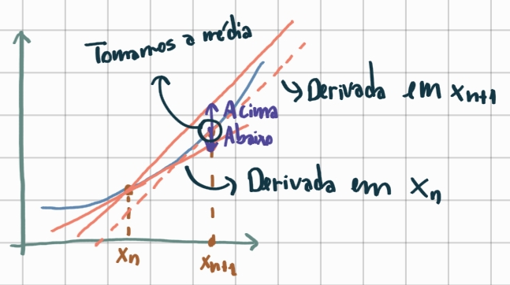

# Métodos numéricos para solução de EDOs

Problemas de valor inicial para equações diferenciais ordinárias (EDOs)
ocorrem em quase todas as ciências, tal como a mecânica de Newton, o movimento
das partículas, evoluções de doenças, mecânica quântica (aqui uma equação
parcial é am ias conhecida), entre outros. No [cálculo das variações](https://lucasmoschen.github.io/ta-sessions/edp/calculus_of_variations/), essa
teoria também é muito importante, como vimos no curso de EDP. Mais motivações
dessa área são deixados para outros materiais, como [esse aqui](https://mathinsight.org/ordinary_differential_equation_introduction),
[esse aqui](https://towardsdatascience.com/ordinal-differential-equation-ode-in-python-8dc1de21323b),
ou algum livro de EDOs recomendado pelo curso.  

O problema de valor inicial padrão envolve um sistema de equações 
diferenciais de primeira ordem, 
$$\frac{dy_i}{dx} = f_i(x,y_1, \dots, y_n), \quad i = 1, \dots, n$$
e suas condições iniciais, 
$$y_i(a) = y_i^{(0)}, \quad i = 1, \dots n.$$
Uma equação de segunda ordem, tal como 
$$y'' + y = a$$
pode ser transformada em um sistema de primeira ordem introduzindo 
a variável $z = y'$. 

> A existência de soluções em um sistema de EDOs é garantida quando a função
> é contínua, enquanto a unicidade é garantida quando as últimas $n-1$
> componentes são Lipshitz Contínuas. Mais detalhes podem ser consultados [aqui](https://github.com/lucasmoschen/ta-sessions/blob/master/Ordinary_Differential_Equations/Extra/TeoremaFundamental.pdf)
> para um resumo, ou algum texto-livro de EDOs. 

## Métodos numéricos 

Suponha que queremos resolver 
$$\frac{dy}{dx} = f(x,y), y \in \mathbb{R}^n, x \in \mathbb{R}, y(0) = y_0.$$

Existem basicamente dois tipos de métodos para solução numérica de EDOs, 
os **métodos por aproximação analítica** que buscam aproximar a função 
$y(x)$ para qualquer ponto $x \in [a,b]$, tomando a forma de uma expansão de
série truncada; e os **métodos variável-discreta** que procuram estimar
a função em pontos $y(x_i)$ para $x_i \in \{x_1, \dots, x_p\} \subset [a,b]$. 

### Métodos de um passo 

Para $x \in [a,b]$, definimos esses tipos de método por 
$$y_{\mathrm{next}} = y + h\Phi(x, y, h), h > 0,$$
em que $\Phi : [a,b] \times \mathbb{R}^n \times \mathbb{R}_{+} \to
\mathbb{R}^n$ com uma incrementação aproximada por passo. 

Chamamos de **solução referência** a função $u(t)$ tal que 
$$\frac{du}{dt} = f(t,u), x \le t \le x + h, u(x) = y.$$
Temos que $y_{\mathrm{next}}$ procura estimar $u(x+h)$. Para avaliar essa 
aproximação, definimos o **erro de truncamento** dado pela expressão
$$T(x,y,h) = \frac{1}{h}[y_{\mathrm{next}} - u(x+h)].$$
Dizemos que o método, dado pela descrição de $\Phi$, é **consistente** se 
$$T(x,y,h) \to 0, \; \text{ quando  } h \to 0.$$
Também dizemos que o método é de ordem $p$ se para alguma norma (não importa
qual nesse contexto pela equivalência das normas) e para algum $C \in
\mathbb{R}$, vale que 
$$||T(x,y,h)|| \le Ch^p.$$

### Método de Euler 

No método de Euler, temos que $\Phi(x,y,h) = f(x,y)$. Note que o passo 
será a expansão de Taylor de primeira ordem: 
$$y_{\mathrm{next}} = y + hf(x,y).$$
O erro de truncamento é
$$T(x,y,h) = \frac{1}{h}(y + hf(x,y) - u(x+h)) = f(x,y) - \frac{1}{h}(u(x+h) -
u(x)).$$
que é claramente consistente, porque quando $h$ tende a 0, temos que a
expressão de $u$ converge para $u'(x) = f(x,y)$. Além disso, note que 
$$T(x,y,h) = u'(x) - \frac{1}{h}\left(u(x) + hu'(x) + \frac{h^2}{2}u''(\xi(x)) -
u(x)\right) = -\frac{h}{2}u''(\xi(x)),$$
em que $\xi(x) \in (x, x+h)$ pelo Teorema do Valor Médio e usando a 
expansão de Taylor. Isso nos permite mostrar que $||T(x,y,h)|| \le Ch$ e 
o método de Euler é de ordem $p=1$. 

Para verificar a ordem, uma maneira relativamente fácil é 
verificar que $0 \le |y(x_k) - y_k| \le (1 + hL)|y(x_{k-1}) - y_{k-1}| +
Dh^2$, em que $L$ é a constante de Lipschitz de $f$ e $D =
\max_{[a,b]}||y''(\xi)||$.

Na vida real, o método de Euler é pouco utilizado, pois o seu erro se 
acumula ao longo das iterações e a curva fica bem diferente ao longo 
do tempo. Lembre que ele é uma boa aproximação local, mas uma péssima 
global. 

### Método de Heun 

Vamos tentar corrigir a separação da curva real com a aproximação 
por Euler. O algoritmo Heun atende a esse requisito de correção. 
Em vez de focar no ponto inicial à esquerda do intervalo em que 
calculamos $f(x,y)$, usamos a informação do ponto final da curva. A ideia é
que quando a tangente subestima o valor da função no ponto à esquerda do
intervalo, teremos que ela superestimará quando pegarmos do ponto à direita
(pelo menos em funções bem comportadas e $h$ suficientemente pequeno). A
imagem abaixo ilustra esse fato: 

Com isso, o método fica 
$$y_n = y_{n-1} + h\frac{f(x_{n-1}, y_{n-1}) + f(x_n, y_n)}{2},$$
que é um método implícito. Para isso, aproximamos $y_n$ na equação da direita
por $$y_{n-1} + hf(x_{n-1}, y_{n-1}),$$
que é o método de Euler. Esse método tem ordem $p=2$. 

Para mais detalhes, [confira esse
site](http://calculuslab.deltacollege.edu/ODE/7-C-2/7-C-2-h.html). 

### Métodos de Taylor 

Considere as derivadas totais de $f$ dadas por 
$$f^{[0]}(x,y) = f(x,y), \\ 
f^{[k+1]}(x,y) = f_x^{[k]}(x,y) + f_y^{[k]}(x,y)f(x,y), k \in
\mathbb{Z}_{+}.$$
Portanto, 
$$u^{(k+1)}(t) = f^{[k]}(t, u(t))$$
e o método se torna 
$$\Phi(x,y,h) = f^{[0]}(x,y) + \frac{1}{2}hf^{[1]}(x,y) + \cdots
+\frac{1}{p!}h^{p-1}f^{[p-1]}(x,y).$$
Obteremos que o erro de truncagem é 
$$||T(x,y,h)|| \le \frac{C_p}{(p+1)!}h^p.$$

### Métodos Runge-Kutta 

A ideia desses métodos é escrever 
$$\Phi(x,y,h) = \sum_{i=1}^r \alpha_s k_s,$$
tal que
$$k_1(x,y) = f(x,y)$$
e 
$$k_s(x,y,h) = f\left(x + \mu_s h, y +
h\sum_{j=1}^{s-1}\lambda_{s_j}k_j\right), 2 \le s \le r.$$
É natural impor que 
$$\mu_s = \sum_{j=1}^{s-1} \lambda_{s_j}, \quad \sum_{s=1}^r \alpha_s = 1.$$
Por fim, basta definir esses parâmetros adicionais introduzidos. O
Runge-Kutta clássico de ordem 4 tem que $r = 4$, 
$$\alpha_1 = \alpha_4 = 1/6, \alpha_2 = \alpha_3 = 2/6,$$
$$\mu_2 = \mu_3 = 1/2, \mu_4 = 1.$$

[Esse é um
tutorial](https://www.math.auckland.ac.nz/~butcher/ODE-book-2008/Tutorials/RK-methods.pdf)
que pode ser útil. Não se deixe enganar pelo "tutorial", tem bastante
matemática. [Esse também é um bom
resumo](https://www.johndcook.com/blog/2020/02/13/runge-kutta-methods/). 