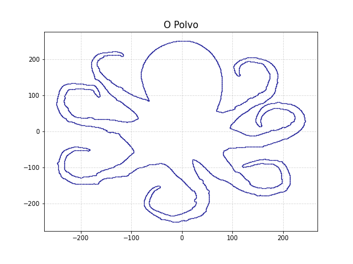

# Lista 5 - Equações Diferenciais Parciais 

Essas são possíveis soluções.  

### Exercícios Teóricos 

Nesse parte, exponho os exercícios propostos para serem realizados de forma
teórica.


### Exercícios Computacionais 

#### Afinador

Nessa seção, apresentados um simples afinador construído com Matlab. O
princípio é bem básico: Faço a transformação do espaço temporal para o espaço
das frequências utilizando a transformada de Fourier FFT. Depois, observamos
que teremos a frequência dominante e seus harmônicos, dado o comportamento da
onda. Por esse motivo, precisamos de uma técnica para, dentre os harmônicos,
ver qual de fato é o dominante. 

A técnica utilizada é o HPS (Harmonic Product Spectrum). Ele se utiliza do
fato de um harmônico ter frequência múltipla daa frequência dominante. A
técnica funciona rapidamente, o que é interessante. Não há nenhuma outra filtragem, portanto, em um local muito ruidoso, talvez
não funcione o afinador. 

A entrada é uma `string` com o nome do arquivo `.wav` e a saída é a nota com
frequência mais aproximada entre `C, C#, D, D#, E, F, F#, G, G#, A, A#, B`. 

```{matlab}
note = afinador('CordaViolao.wav');
disp('A nota tocada foi: ')
disp(note)

function [note] = hps(yhat, n, N)
    % Esta função tem o objetivo de calcular o espectro produto harmônico
    % A partir de uma yhat na frequência e de um número N de harmônicos 
    % calcula média geométrica. 
    
    % Queremos reconhecer os harmônicos do tom principal. 
    note = ones(n,1);
    bins = 1:n;
    for i = 1:N
       bins_temp = bins*i; 
       xhat = ones(n,1);
       mask = bins_temp <= n;
       xhat(mask) = yhat(bins_temp(mask));
       note = note.*abs(xhat);
    end
    note = (note).^(1/N);
end

function [strnote] = get_note(frequency)
    notes = char({'C','C#','D','D#','E','F','F#','G','G#','A','A#','B'});
    freqs = [523, 554,587, 622,659,698, 740,784, 831,880, 932, 988];
    % Se a frequência não está na oitava, o coloco multiplicando e dividindo
    % por 2. Sabemos que a nota será a mesma, em uma diferente frequência.
    while frequency <= 508 
        frequency = frequency*2;
    end
    while frequency > 988 + 19
        frequency = frequency/2;
    end
    [~, argmin] = min(abs(freqs - frequency));
    strnote = notes(argmin,:);
    strnote = strnote(~isspace(strnote)); 
end

function [note] = afinador(name)
   [y,Fs] = audioread(name);
   n = length(y);
   % transform the time scale to frequency scale
   yhat = fft(y);      
   yhat = abs(yhat);
   
   freq = (1:n)*Fs/n;
    
   % use the function harmonic product spectrum
   yhat = hps(yhat, n, 5);
   % get the dominant tone
   [~, argmax] = max(yhat);
   note = freq(argmax);
   note = get_note(note);
end
```

#### O Polvo

Nesse exercício, primeiro temos o polvo, representado pelos vetores $x$ e $y$



Na letra b somos indagados a produzir sequências $(x_1(t), x_2(t), ... , x_n(t))$ e $(y_1(t), y_2(t), ... , y_n(t))$ que
sejam versões suavizadas das sequências. Para isso, é sugerido utilizar a
solução da equação do calor. 

Sabemos que $L$ é uma matrix circulante e se descrevermos $P$ como uma matriz
de permutação que coloca a primeira coordenada de um vetor na $n$-ésima
posição, teremos que: 

$$L = l_0I + l_1P + ... + l_{n-1}P^{n-1} = 2I - P - P^{n-1}$$ 

E se $v_j$ é autovalor de $P$, será também de $L$, pois: 

$$Lv_j = 2v_j - \lambda_jv_j - \lambda_j^{n-1}v_j = (2 - \lambda_j -
\lambda_j^{n-1})v_j$$  

Além disso, sabemos que autovetores de uma matriz circulante formam a base de
Fourier, e, além disso, os autovalores dessa matriz de permutação são aqueles
que resolvem a equação $\lambda^n = 1$. E portanto, $\lambda_j = e^{2\pi ij/n}$. Isto
é, podemos obter os autovalores da matriz $L$ fazendo a transformação de
Fourier na primeira linha de $L$! (Sei que estava no lembrete já, mas quis
conferir as contas).

Aqui segue o código que gera uma sequência de 10 iterações do Polvo. Eu faço
um pré-cálculo da matriz diagonal do sistema como mencionado acima e, se $F$ é
a matriz da transformada de Fourier: 

$$x(t) = e^{-cLt}x_0 = Fe^{-Dt}F^{-1}x_0 = \text{fft}(e^{-Dt}\cdot\text{ifft}(x_0))$$
$$y(t) = e^{-cLt}y_0 = Fe^{-Dt}F^{-1}y_0 = \text{fft}(e^{-Dt}\cdot\text{ifft}(y_0))$$

Aqui vemos o polvo com $c = 0.5$ e $t = 501, 5001, 10001, 14501$. 


Como conclusão, conseguimos sequências $\vec{x}(t)$ e $\vec{y}(t)$ que sejam
versões suavizadas de $\vec{x}$ e $\vec{y}$. 

```{matlab}
polvo = csvread('Polvo.csv');

c = 0.5;
[D,x0,y0] = pre_calculation(polvo(:,1), polvo(:,2), c);

figure
plot(polvo(:,1), polvo(:,2),'r.')
xlim([min(polvo(:,1)), max(polvo(:,1))]);
ylim([min(polvo(:,2)), max(polvo(:,2))]);
title('O Polvo de EDP')
xlabel('x')
ylabel('y')

pause(2)

for t = 1:250:15000
   x = heat_filter(x0, t, D);
   y = heat_filter(y0, t, D);
   plot(x,y)
   disp(t)
   pause(0.1)
   if ismember(t, [501, 10001, 14501])
       saveas(gcf, join(["Polvo-", t, ".png"], ''));
   end
end

clear D;
clear x;
clear y;
clear x0;
clear y0;

function [D, x0, y0] = pre_calculation(x, y, c)
    % Calculate the diagonal matrix of convolucional matrix of size n
    n = length(x);
    D = fft(c*[-2,1,zeros(1,n-3),1]');
    x0 = ifft(x);
    y0 = ifft(y);
end

function  [filter] = heat_filter(u0, t, D)
    % This function get a vector, make a convolucional filter (gaussian),
    % that is equivalent to the solution of heat equation and return, for
    % each t, the x(t) smoothed.
    filter = exp(D*t).*u0;
    filter = real(fft(filter));
end
```