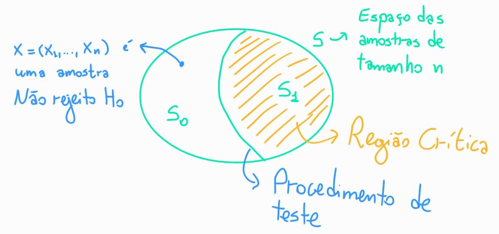

# Teste de Hipóteses: Definições

1. Hipótese Nula e Alternativa 
2. Região Crítica 
3. Estatística de Teste
4. Função de Poder
5. Tipos de Erro 
6. Nível e tamanho do teste
7. p-valor

Temos um problema estatístico que envolve um parâmetro $\theta$ tal que tenha valor desconhecido, mas reside em um espaço $\Omega$. Suponha que particionemos $\Omega = \Omega_1 \dot\cup ~\Omega_2$ e o estatístico está interessado se $\theta$ está em $\Omega_0$ ou está em $\Omega_1$. 

## Hipótese Nula e Alternativa 

Dizemos que $H_0$ é a hipótese de que $\theta \in \Omega_0$ e chamamos $H_0$ de **hipótese nula**, enquanto $H_1$ é a hipótese alternativa e representa $\theta \in H_1$. Queremos decidir qual das hipóteses é verdadeira (e só uma será, porque a partição é disjunta). Se decidimos que $\theta \in \Omega_1$, rejeitamos $H_0$, e se $\theta \in \Omega_0$, não rejeitamos $H_0$. 

## Hipótese Simples e Composta 

Suponha que $X_1, ..., X_n$ formam uma amostra aleatória com pdf $f(x|\theta)$. Queremos testar a hipótese de que 

$$
H_0: \theta \in \Omega_0
$$
$$
H_1: \theta \in \Omega_1
$$

Se $\Omega_i$ contem apenas um valor, então $H_i$ é dita hipótese simples. Se contém mais de um valor, dizemos que é composta. 

## Hipótese Unilateral e Bilateral 

Seja $\theta$ um parâmetro unidimensional. Dizemos que a hipótese $H_0$ é unilateral (ou *one tailed*) quando é da forma $\theta \leq \theta_0$ ou $\theta \geq \theta_0$. Ela será bilateral quando é do tipo $H_0 \neq \theta_0$. 

## Região Crítica 

Suponha que queremos testar a hipótese de que 

$$
H_0: \theta \in \Omega_0 \text{ e } H_1: \theta \in \Omega_1
$$

Quando queremos decidir qual hipótese escolher, observamos uma amostra dessa distribuição no espaço de amostras $S$. O dever do estatístico é especificar um procedimento que particione o conjunto em dois subconjuntos $S_0$ e $S_1$, onde $S_1$ contém os valores de $X$ que rejeitam $H_0$. 

**Região crítica** é o conjunto $S_1$, isto é, o conjunto de amostras que, a partir de um procedimento, rejeita $H_0$. 

## Estatística de Teste

Seja $X_1, ..., X_n \overset{iid}{\sim} F(\theta)$. Sejam $T = r(X)$ uma estatística e $R$ um subconjunto da reta. Suponha que nosso procedimento de teste é o seguinte: 

> Rejeitamos $H_0$ se $T\in R$.

Chamamos $T$ de **estatística de teste** e $R$ de **região de rejeição**. Dessa forma a região crítica será: $S_1 = \{x \in S: r(x) \in R\}$. 

Na prática a maioria dos testes é do tipo

> Rejeitamos $H_0$ se $T \geq c, c \in \mathbb{R}$.

### Observação sobre a divisão de conjuntos

É importante lembrar que há duas diferentes divisões:
$\Omega = \Omega_0 \dot\cup \Omega_1$, que é a divisão do espaço dos parâmetros, e $S = S_1 \dot\cup S_1$ é a divisão do espaço das amostras. Mas qual a relação entre eles? Se $X \in S_1$, então rejeitamos a hipótese $\theta \in \Omega_0$. Além do mais, podemos encontrar $S_1$ e $S_2$, mas dificilmente saberemos em qual dos conjuntos $\theta$ pertence. 

## Função de Poder e Tipos de Erro

### Função Poder 

Seja $\delta$ um procedimento de teste (como esse assinalado acima). Se $S_1$ é a região crítica, 

$$
\pi(\theta|\delta) = P(X \in S_1|\theta) = P(T \in R|\theta)
$$

Sendo que a última igualdade ocorre quando o proocedimento de teste é o citado acima. 

**O seu significado?**

É a probabilidade, para cada valor de $\theta$, de que $\delta$ rejeita $H_0$. Queremos, intuitivamente que:

$$
\theta \in \Omega_0 \rightarrow \text{ Queremos não rejeitar} H_0 \rightarrow \pi(\theta|\delta) = 0 
$$
$$
\theta \in \Omega_1 \rightarrow \text{ Queremos rejeitar} H_0 \rightarrow \pi(\theta|\delta) = 1 
$$

Entretanto isso não é em geral o que acontece. Por isso definimos:

### Erros I e II

||$\theta \in \Omega_0$|$\theta \in \Omega_1$|
|-|-|-|
|$\delta$ rejeita $H_0$|Erro Tipo I|Certo|
|$\delta$ não rejeita $H_0$|Certo|Erro Tipo II|

Portanto se $\theta \in \Omega_0, \pi(\theta|\delta)$ é a probabilidade de cometermos o erro do tipo I. Se $\theta \in \Omega_1, 1 - \pi(\theta|\delta)$ é a probabilidade de cometer o erro do tipo II. 

## Nível/Tamanho 

Um teste que satisfaz $\pi(\theta|\delta) \leq \alpha_0, \forall \theta \in \Omega_0$ é chamado de teste **nível** $\alpha_0$, ou que o teste tem nível de significância $\alpha_0$.  O **tamanho** de um teste é
$\alpha(\delta) = \sup_{\theta \in \Omega_0} \pi(\theta, \delta)$. Um teste terá nível $\alpha_0$ se, e só se, seu tamanho for no máximo $\alpha_0$. 

## P-valor

É o menor nível $\alpha_0$ tal que rejeitaríamos a hipótese nula a nível $\alpha_0$ com os dados observados. 

> Se rejeitamos a hipótese nula se, e somente se, o p-valor é no máximo $\alpha_0$, estamos usando um teste com nível de significância $\alpha_0$.

# Equivalência entre Testes e Conjuntos de Confiança 

### Teorema

Seja $\vec{X} = (X_1,...,X_n) \overset{iid}{\sim} F(\theta)$. Seja $g(\theta)$, e suponha que para todo valor $c$ na imagem de $g$ (ou seja, $c = g(x)$, para algum $x$), exista um teste $\delta_c$ de nível $\alpha_0$ para a hipótese 

$$
H_{0,c}:g(\theta) = c, ~ H_{1,c}: g(\theta) \neq c
$$

Defina 

$\omega(x) := \{c: \delta_c \text{ não rejeita } H_{0,c} \text{ se } \vec{X} = \vec{x} \text{ é observado } \}$. 

Então:
$$
P[g(\theta_0) \in \omega(\vec{X})|\theta = \theta_0] \geq 1 - \alpha_0,
$$

para todo valor $\theta \in \Omega$. 

# Compreensão e Implementação 

Teste de hipótese é um método estatístico para que façamos decisões estatísticas sobre os dados. É uma forma de comppreender um parâmetro. 

> **Exemplo:**  Belgas tem, em média, maior altura do que peruanos. 

> **Exemplo 2:** Esse fator (parâmetro) não é relevante para o processo. 

Estamos avaliando afirmações mutualmente exclusivas, ou os belgas tem maior altura do que os peruanos, ou não tem! Queremos saber qual dessas afirmações é suportada pelos dados que obtermos. A hipótese nula é em geral a ser testada e muitas vezes estabelece uma conjectura de que as características observadas em uma população são por um acaso, isto é, o fator a ser estudado "não existe". Em geral queremos anulá-la, rejeitá-la. 