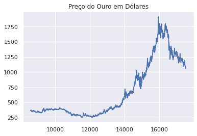
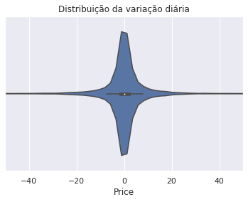
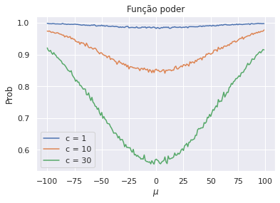
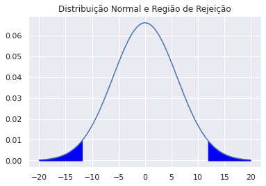

# Teste de Hipóteses: Definições

1. Hipótese Nula e Alternativa 
2. Região Crítica 
3. Estatística de Teste
4. Função de Poder
5. Tipos de Erro 
6. Nível e tamanho do teste
7. P-valor

Temos um problema estatístico que envolve um parâmetro $\theta$ tal que tenha valor desconhecido, mas reside em um espaço $\Omega$. Suponha que particionemos $\Omega = \Omega_1 \dot\cup ~\Omega_2$ e o estatístico está interessado se $\theta$ está em $\Omega_0$ ou está em $\Omega_1$. 

## Hipótese Nula e Alternativa 

Dizemos que $H_0$ é a hipótese de que $\theta \in \Omega_0$ e chamamos $H_0$ de **hipótese nula**, enquanto $H_1$ é a hipótese alternativa e representa $\theta \in H_1$. Queremos decidir qual das hipóteses é verdadeira (e só uma será, porque a partição é disjunta). Se decidimos que $\theta \in \Omega_1$, rejeitamos $H_0$, e se $\theta \in \Omega_0$, não rejeitamos $H_0$. 

## Hipótese Simples e Composta 

Suponha que $X_1, ..., X_n$ formam uma amostra aleatória com pdf $f(x|\theta)$. Queremos testar a hipótese de que 

$$
H_0: \theta \in \Omega_0
$$
$$
H_1: \theta \in \Omega_1
$$

Se $\Omega_i$ contem apenas um valor, então $H_i$ é dita hipótese simples. Se contém mais de um valor, dizemos que é composta. 

## Hipótese Unilateral e Bilateral 

Seja $\theta$ um parâmetro unidimensional. Dizemos que a hipótese $H_0$ é unilateral (ou *one tailed*) quando é da forma $\theta \leq \theta_0$ ou $\theta \geq \theta_0$. Ela será bilateral quando é do tipo $H_0 \neq \theta_0$. 

## Região Crítica 

Suponha que queremos testar a hipótese de que 

$$
H_0: \theta \in \Omega_0 \text{ e } H_1: \theta \in \Omega_1
$$

Quando queremos decidir qual hipótese escolher, observamos uma amostra dessa distribuição no espaço de amostras $S$. O dever do estatístico é especificar um procedimento que particione o conjunto em dois subconjuntos $S_0$ e $S_1$, onde $S_1$ contém os valores de $X$ que rejeitam $H_0$. 

**Região crítica** é o conjunto $S_1$, isto é, o conjunto de amostras que, a partir de um procedimento, rejeita $H_0$. 


## Estatística de Teste

Seja $X_1, ..., X_n \overset{iid}{\sim} F(\theta)$. Sejam $T = r(X)$ uma estatística e $R$ um subconjunto da reta. Suponha que nosso procedimento de teste é o seguinte: 

> Rejeitamos $H_0$ se $T\in R$.

Chamamos $T$ de **estatística de teste** e $R$ de **região de rejeição**. Dessa forma a região crítica será: $S_1 = \{x \in S: r(x) \in R\}$. 

Na prática a maioria dos testes é do tipo

> Rejeitamos $H_0$ se $T \geq c, c \in \mathbb{R}$.

### Observação sobre a divisão de conjuntos

É importante lembrar que há duas diferentes divisões:
$\Omega = \Omega_0 \dot\cup \Omega_1$, que é a divisão do espaço dos parâmetros, e $S = S_1 \dot\cup S_1$ é a divisão do espaço das amostras. Mas qual a relação entre eles? Se $X \in S_1$, então rejeitamos a hipótese $\theta \in \Omega_0$. Além do mais, podemos encontrar $S_1$ e $S_2$, mas dificilmente saberemos em qual dos conjuntos $\theta$ pertence. 

## Função de Poder e Tipos de Erro

### Função Poder 

Seja $\delta$ um procedimento de teste (como esse assinalado acima). Se $S_1$ é a região crítica, 

$$
\pi(\theta|\delta) = P(X \in S_1|\theta) = P(T \in R|\theta)
$$

Sendo que a última igualdade ocorre quando o proocedimento de teste é o citado acima. 

**O seu significado?**

É a probabilidade, para cada valor de $\theta$, de que $\delta$ rejeita $H_0$. Queremos, intuitivamente que:

$$
\theta \in \Omega_0 \rightarrow \text{ Queremos não rejeitar} H_0 \rightarrow \pi(\theta|\delta) = 0 
$$
$$
\theta \in \Omega_1 \rightarrow \text{ Queremos rejeitar} H_0 \rightarrow \pi(\theta|\delta) = 1 
$$

Entretanto isso não é em geral o que acontece. Por isso definimos:

### Erros I e II

||$\theta \in \Omega_0$|$\theta \in \Omega_1$|
|-|-|-|
|$\delta$ rejeita $H_0$|Erro Tipo I|Certo|
|$\delta$ não rejeita $H_0$|Certo|Erro Tipo II|

Portanto se $\theta \in \Omega_0, \pi(\theta|\delta)$ é a probabilidade de cometermos o erro do tipo I. Se $\theta \in \Omega_1, 1 - \pi(\theta|\delta)$ é a probabilidade de cometer o erro do tipo II. 

## Nível/Tamanho 

Um teste que satisfaz $\pi(\theta|\delta) \leq \alpha_0, \forall \theta \in \Omega_0$ é chamado de teste **nível** $\alpha_0$, ou que o teste tem nível de significância $\alpha_0$.  O **tamanho** de um teste é
$\alpha(\delta) = \sup_{\theta \in \Omega_0} \pi(\theta, \delta)$. Um teste terá nível $\alpha_0$ se, e só se, seu tamanho for no máximo $\alpha_0$. 

## P-valor

É o menor nível $\alpha_0$ tal que rejeitaríamos a hipótese nula a nível $\alpha_0$ com os dados observados. 

> Se rejeitamos a hipótese nula se, e somente se, o p-valor é no máximo $\alpha_0$, estamos usando um teste com nível de significância $\alpha_0$.

# Equivalência entre Testes e Conjuntos de Confiança 

### Teorema

Seja $\vec{X} = (X_1,...,X_n) \overset{iid}{\sim} F(\theta)$. Seja $g(\theta)$, e suponha que para todo valor $c$ na imagem de $g$ (ou seja, $c = g(x)$, para algum $x$), exista um teste $\delta_c$ de nível $\alpha_0$ para a hipótese 

$$
H_{0,c}:g(\theta) = c, ~ H_{1,c}: g(\theta) \neq c
$$

Defina 

$\omega(x) := \{c: \delta_c \text{ não rejeita } H_{0,c} \text{ se } \vec{X} = \vec{x} \text{ é observado } \}$. 

Então:
$$
P[g(\theta_0) \in \omega(\vec{X})|\theta = \theta_0] \geq 1 - \alpha_0,
$$

para todo valor $\theta \in \Omega$. 

# Compreensão e Implementação 

Teste de hipótese é um método para que façamos decisões estatísticas a partir dos dados. É uma forma de compreender (fazer inferância sobre) um parâmetro. 

> **Exemplo:** Belgas tem, em média, maior altura do que peruanos. 

> **Exemplo 2:** Temperatura não é um fator relevante para o processo de cultivo de uva.

Estamos avaliando afirmações mutualmente exclusivas, *ou os belgas tem maior altura do que os peruanos, ou não tem!* Queremos saber qual dessas afirmações é suportada pelos dados que obtivermos. 

A hipótese nula é a afirmação a ser testada e muitas vezes estabelece uma conjectura de que as características observadas em uma população são por um acaso, isto é, o fator a ser estudado "não existe". Por exemplo: o número de voos entre Rio de Janeiro e São Paulo não tem correlação com o nível do mar no Japão. 

Em geral queremos anulá-la, rejeitá-la (daí o nome). 

### Exemplo 

Vamos considerar um exemplo simples utilizando a distribuição normal. É a distribuição com cálculos simples e uma boa visualização. A ideia nesse exemplo vai ser a seguinte: 

> O preço do quilo ouro varia diariamente e essa variação em unidade de dólares será nosso objeto de interesse. Por exemplo: Se no dia 1 o preço mil e no dia 2 o preço era 1 050 e no dia 3 o preço é 1 025 temos que $X_1 = 50$ e $X_2 = -25$. Vamos supor que as variações entre dois diferentes pares de dias são independentes (essa já uma simplificação da realidade!)

Primeiro vamos importar os dados. 


```python
import pandas as pd
import numpy as np

import matplotlib.pyplot as plt
import matplotlib.patches as mpatches
import seaborn as sns
sns.set()
```


```python
gold_df = pd.read_csv('../data/gold.csv', low_memory = False, header=[2,3,4])
# There has a lot of data. I will get average diary from USD price 
gold_df = gold_df[[('Priced In', 'Price Type', 'Summary'), ('USD', 'Ask', 'Average')]]
gold_df.columns = ['Day', 'Price']
gold_df.head()
```


<div>
<style scoped>
    .dataframe tbody tr th:only-of-type {
        vertical-align: middle;
    }

    .dataframe tbody tr th {
        vertical-align: top;
    }

    .dataframe thead th {
        text-align: right;
    }
</style>
<table border="1" class="dataframe">
  <thead>
    <tr style="text-align: right;">
      <th></th>
      <th>Day</th>
      <th>Price</th>
    </tr>
  </thead>
  <tbody>
    <tr>
      <th>0</th>
      <td>1/01/68</td>
      <td>NaN</td>
    </tr>
    <tr>
      <th>1</th>
      <td>2/01/68</td>
      <td>NaN</td>
    </tr>
    <tr>
      <th>2</th>
      <td>3/01/68</td>
      <td>NaN</td>
    </tr>
    <tr>
      <th>3</th>
      <td>4/01/68</td>
      <td>NaN</td>
    </tr>
    <tr>
      <th>4</th>
      <td>5/01/68</td>
      <td>NaN</td>
    </tr>
  </tbody>
</table>
</div>


Observe que existem diversos Nan values. Na prática eu teria que fazer alguma espécie de limpeza rigorosa. Nesse caso, para tornar tudo bem simples, vou apenas limpar. Também precisamos garantir que as informações estejam em formato `float`. 


```python
# Inplace assegura que eu não crie outro DataFrame
gold_df.dropna(inplace = True)
gold_df.Price = gold_df.Price.apply(lambda x: float(x.strip().replace(',', '')))
```


```python
plt.plot(gold_df['Price'])
plt.title('Preço do Ouro em Dólares')
plt.show()
```





```python
variation = gold_df.Price.diff()
sns.violinplot(x = variation)
plt.xlim((-50,50))
plt.title('Distribuição da variação diária')
plt.show()
```





De fato não parece uma normal (na verdade uma distribuição de cauda mais pesada talvez fosse interessante. Mas tudo bem!), mas vamos modelar dessa forma. A partir de agora vamos nos preocupar mais com as definições para dar a devida interpretação. O exemplo é só motivador. 

**Qual hipótese queremos testar? O que queremos saber sobre a variação?**

A pergunta que nasce é o seguinte: será que a média dessa distribuição é 0? Isto é, será que se calcularmos as médias das variações, teremos que com infinitas observações, o resultado seria 0? Isso é importante porque vai nos ajudar a identificar se existe uma tendência de crescimento nas variações diárias. 

> **Hipótese Nula:** $\mu = 0$, onde $X_1, ..., X_n \sim N(\mu, \sigma^2)$.

> **Hipótese Alternativa:** $\mu \neq 0$. 

Vamos supor que $\sigma$ é conhecido e que $\sigma^2 = 73$, mas a média é desconhecida. 

1. **Quem é $\Omega_0$ e $\Omega_1$?**

$\Omega_0$ é a região dos parâmetros onde a hipótese nula é verdadeira, isto é $\Omega_0 = \{0\}$, é um conjunto unitário. Por outro lado $\Omega_1 = \mathbb{R} - \{0\}$, por que a média pode assumir, em teoria, qualquer valor real. 

2. **Qual é a região crítica?**

Bom, ainda não podemos determinar essa resposta, afinal para determinar a região crítica (subconjunto do espaço dos estados em que se rejeita a hipótese nula), precisamos de um procedimento de teste. Mas vamos imaginar que o espaço de estados é $S = \mathbb{R}^2$, pois vamos considerar apenas duas amostras, inicialmente (queremos visualizar S). 

3. **Qual será nosso procedimento de teste?**

Procedimento de teste é uma maneira de tomarmos uma decisão. Ele tem a forma: rejeitamos $H_0$ se isso acontecer. 

Um exemplo bobo seria: Rejeitamos a hipótese nula se $0 \not \in (\min(X_1, X_2), \max(X_1, X_2))$

O problema é que em geral esse tipo de procedimento não é interessante. Para isso estabelecemos uma **estatística de teste** $T$ e uma **Região de Rejeição** $T$, tal que nosso procedimento seja: 

> Rejeitamos $H_0$ se $T \in R$. 

Nesse caso vamos considerar $T = \frac{X_1 + X_2}{2}$ e vamos rejeitar a hipótese se $|T|$ estiver muito longe de $0$, isto é, se $|T| \geq c$. Portanto definimor nossa **Região de Rejeição** como $(-\infty,-c]\cup[c, + \infty)$, o que reduz nosso problema a determinar $c$. 

Qual $c$ seria razoável? 4, 5, 1? Essa pergunta não vai ser respondida. Antes vamos visualizar como fica a região crítica (2). Rejeitamos a hipótese se 

$$
\left|\frac{X_1 + X_2}{2}\right| \geq c \rightarrow |X_1 + X_2| \geq 2c \rightarrow X_1 + X_2 \geq 2c \text{ ou } X_1 + X_2 \leq -2c
$$

Assim: $S_1 = \{(x_1, x_2): x_1 + x_2 \geq 2c \text{ ou } x_1 + x_2 \leq -2c\}$


```python
C = [1, 10, 30]
decision = lambda x1, x2, c: 1*np.logical_or(x1 + x2 >= 2*c, x1 + x2 <= -2*c)
x1,x2 = np.meshgrid(np.arange(-50,50,0.5),np.arange(-50,50,0.5))

fig, ax = plt.subplots(1,3, figsize = (21, 7))
for i, c in enumerate(C):
    ax[i].contourf(x1,x2,decision(x1,x2, c), levels = [0, 0.5, 1], colors = ['#fdcdac', '#cbd5e8'])
    ax[i].set_xlabel(r'$x_1$', fontsize = 20)
    ax[i].set_ylabel(r'$x_2$', fontsize = 20)
    ax[i].set_title('Região Crítica quando c = {}'.format(c), fontsize = 20)
    ax[i].legend(handles = [mpatches.Patch(color='#fdcdac', label=r'$S_0$'),
                            mpatches.Patch(color='#cbd5e8', label=r'$S_1$')])
    
    sample = gold_df.Price.diff().sample(n = 2)
    X1, X2 = sample.iloc[0], sample.iloc[1]
    ax[i].scatter(X1, X2, color = 'black')
    ax[i].text(X1 + 1, X2 + 1, s = r'$(X_1, X_2)$', fontsize = 15)
```


4. **Como a função poder entra nessa história?**

A função poder é uma função do parâmetro, no caso $\mu$, e retorna a probabilidade de rejeitarmos a hipótese, considerando esse parâmetro. Isto é, 

$$
\pi(\mu) = P_{\mu}((X_1, X_2) \in S_1)
$$

O que poderíamos fazer, então, é obter a distribuição conjunta de $(X_1, X_2)$ e integrar na região $S_1$. 

Vamos considerar dois casos separados:

- $\mu \in \Omega_0$: Não sabemos disso, e em geral não é possível sabermos. Nesse caso $\pi(\mu)$ indica a probabilidade de rejeitarmos a hipótese nula, mesmo ela sendo verdadeira (chamamos isso de Erro do Tipo I).

- $\mu \in \Omega_1$: Nesse caso $\pi(\mu)$ indica a probabilidade de rejeitarmos a hipótese nula, quando de ela é falsa. Nesse caso $1 - \pi(\mu)$ é a probabilidade de não rejeitarmos a hipótese nula, quando de fato deveríamos (chamamos de Erro do Tipo II). ]

A função poder se trata mais do teste que estamos usando do que os dados em si. Por isso, podemos comparar testes usando essa função poder. Então vamos ver nesse caso quem é a função poder! Vou calcular usando um método numérico para que peguem a ideia. Agora é possível fazer as contas, mas nem sempre é trivial. Assim teremos apenas aproximação da função poder. 


```python
C = [1, 10, 30]
mu_v = np.arange(-100, 100, 1)
n = 10000
power = np.zeros((len(C),len(mu_v)))

for i, c in enumerate(C):
    for j, mu in enumerate(mu_v): 
        X1 = np.random.normal(loc = mu, scale = 73, size = n)
        X2 = np.random.normal(loc = mu, scale = 73, size = n)
        p = (sum(X1 + X2 >= 2*c) + sum(X1 + X2 <= -2*c))/n
        power[i,j] = p

    plt.plot(mu_v, power[i,:], label = 'c = {}'.format(c))

plt.title('Função poder')
plt.xlabel(r'$\mu$')
plt.ylabel('Prob')
plt.legend()
plt.show()
```





5. Vamos definir $c$ agora? 

Sim, vamos. Para isso vamos usar o ponto (4) e a definição de tamanho do teste. Uma forma possível de se fazer isso é a seguinte: limitamos o Erro I por $\alpha_0$ e miniminizamos o Erro II, isso é minimizamos $1 - \pi(\mu)$ quando $\mu \neq 0$, ou melhor, maximizamos $\pi(\mu)$. 

Para isso dizemos que o tamanho do teste é o máximo da função poder, quando $\theta \in \Omega_0$. Nesse caso $\alpha(\delta) = \pi(0)$. Queremos, então que:

$$
\pi(0) = P_{\mu = 0}(T \geq c) \leq \alpha_0
$$

Precisamos então encontrar $c$ tal que $\pi(\mu) = P_{\mu \neq 0}(T \ge c)$ seja maximado.

Observamos que, quando $\mu = 0$, $T \sim N(0, \sigma^2/2) \rightarrow \sqrt{2}T/\sigma = Z \sim N(0,1)$. Logo 

$$P(|T| \ge c) = P(|Z| \ge \sqrt{2}c/\sigma) = 2(1 - \Phi(\sqrt{2}c/\sigma)) \leq \alpha_0$$ 

Para maximizar $\pi(\mu)$ em $\Omega_1$, observamos que $\pi(\mu)$ decresce com $c$ (os gráficos acima representam bem isso). Como queremos maximizar, gostaríamos de tomar $c$ o mínimo possível, restrito a 

$$2(1 - \Phi(\sqrt{2}c/\sigma)) \leq \alpha_0 \rightarrow 1 - \alpha_0/2 \leq \Phi(\sqrt{2}c/\sigma)$$ 

como vimos acima. Estamos lidando com uma função inversível, então 

$$
\frac{\sigma}{\sqrt{2}}\Phi^{-1}(1 - \alpha_0/2) \leq c
$$

O melhor valor de $c$ que respeita essa condição e maximiza a relação é, portanto 

$$
c = \frac{\sigma}{\sqrt{2}}\Phi^{-1}(1 - \alpha_0/2) 
$$


```python
from scipy.stats import norm
```

Lembre que $\alpha_0$ indica o máximo de Erro I que aceitamos. 


```python
alpha0 = 0.05
c = np.sqrt(73)/np.sqrt(2)*norm.ppf(1 - alpha0/2)
print(c)
```

    11.841167465893536


É bem próximo do gráfico acima mostrado, quando testamos para $c = 10$. 


```python
t = np.arange(-20,20,0.1)
X = norm(loc = 0, scale = np.sqrt(73)/np.sqrt(2))
plt.plot(t, X.pdf(t))
plt.fill_between(t[(t < -c)], X.pdf(t[(t < -c)]), color = 'blue')
plt.fill_between(t[(t > c)], X.pdf(t[(t > c)]), color = 'blue')
plt.title('Distribuição Normal e Região de Rejeição')
plt.show()
```





Por exemplo vamos tirar duas amostras de nossa distribuição


```python
X1, X2 = gold_df.Price.diff().sample(2)
T = np.abs(X1 + X2)/2
T >= c
```


    False


6. Mas como escolher $\alpha_0$ agora? 

Agora entra o conceito mais complexo, o do p-valor. Ele está associado à ideia de escolher o menor $\alpha_0$ possível, para que rejeitemos a hipótese nula. Isso significa o seguinte:

> Queremos minimizar o Erro do Tipo I e rejeitar a Hipótese Nula com os dados que obtivemos. Se o p-valor for muito alto, significa que o Erro do Tipo I é grande se rejeitarmos a hipótese nula. Você apostaria que podemos rejeitar a hipótese nula nesse caso? Agora, se o p-valor for pequeno e rejeitarmos nossa hipótese nula, o erro do tipo I vai ser pequeno, então apostar que a hipótese nula deva ser rejeitada é mais confortável.

Assim não escolhemos $\alpha_0$, só observamos seu menor valor e vemos se faz sentido. Em geral se p-valor < 0.05, as pessoas rejeitam a hipótese nula. 

No nosso caso calcular o p-valor é tranquilo. Para calcular o p-valor, **precisamos dos dados**. Queremos rejeitar a hipótese nula, isto é, queremos que $t \geq c$ que $\alpha_0$ seja o menor possível, onde $t$ é o valor observado de $T$. Vamos diminuindo $\alpha_0$ e para cada $\alpha_0$ podemos calcular $c$ e verificamos se $t \ge c$. Podemos fazer isso até que $c = t$, assim:
$$
t = \frac{\sigma}{\sqrt{2}}\Phi^{-1}(1 - \alpha_0/2) \rightarrow \alpha_0 = 2\left(1 - \Phi\left(\frac{\sqrt{2}}{\sigma}t\right)\right)
$$


```python
p_value = 2*(1 - norm.cdf(np.sqrt(2)/np.sqrt(73)*T))
print(p_value)
```

    0.8477386286989927


Como o p-valor é alto, não faz sentido rejeitar a hipótese nula. 

Encerramos a atividade aqui!

# Testes de Razão Verossimilhança 

São testes baseados na [verossimilhaça](https://lucasmoschen.github.io/TA_sessions/infestatistica_BSc/MaximumLikelihoodEstimator/MaximumLikelihoodEstimator/#funcao-verossimilhanca) do modelo $f_n(x|\theta)$. Suponha que queremos testar a hipótese: 

$$
H_0: \theta \in \Omega_0
$$
$$
H_1: \theta \in \Omega_1
$$

Vamos lembrar que a função de verossimilhança tende a ser mais alta próximo do valor verdadeiro do parâmetro. Com isso em mente, gostaríamos de saber se a verossimilhança é maior em $\Omega_0$ ou em $\Omega_1$. Para isso, definimos a **estatística de razão de verossimilhança**:
$$
\Lambda(x) = \frac{\sup_{\theta \in \Omega_0}f_n(x|\theta)}{\sup_{\theta \in \Omega}f_n(x|\theta)}
$$
Observe que o denominador é o valor da função de verossimilhança no Estimador de Máxima Verossimilhança. Se o parâmetro verdadeiro estiver em $\Omega_0$, o númerador deve ser mais alto em $\Omega_0$, então a estatística se aproxima de 1. Baseado nisso, o **teste de razão de verossimilhança** é:

> Rejeitamos $H_0$ se $\Lambda(x) \le k$, para algum $k$. 

### Teorema:

Seja $\Omega \in \mathbb{R}^p$ aberto e suponha que $H_0$ seja $\theta_{i_1} = \theta_{01}, ..., \theta_{i_k} = \theta_{0k}$, onde $\theta = (\theta_1, ..., \theta_p)$. Assuma que $H_0$ seja verdadeira e a função de verossimilhança satisfaça as condições para que o MLE seja assintoticamente normal e assintoticamente eficiente. Então:
$$
-2\log\Lambda(x) \overset{d}{\to} \chi^2(k)
$$
(converge em distribuição quando $n \to \infty$).

A demonstração pode ser encontrada no [StatLect](https://www.statlect.com/fundamentals-of-statistics/likelihood-ratio-test)

## Testes não enviesados 

Um teste é dito não enviesado se $\forall \theta \in \Omega_0$ e $\theta ' \in \Omega_1,$

$$
\pi(\theta|\delta) \le \pi(\theta '|\delta)
$$

Não é muito utilizado dado seu difícil cálculo numérico e não traz resultados quem valem a pena. 
