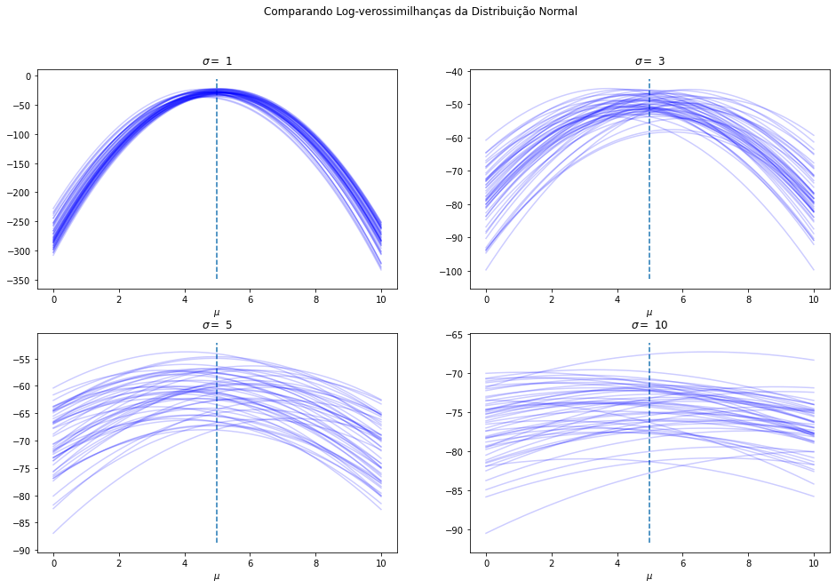
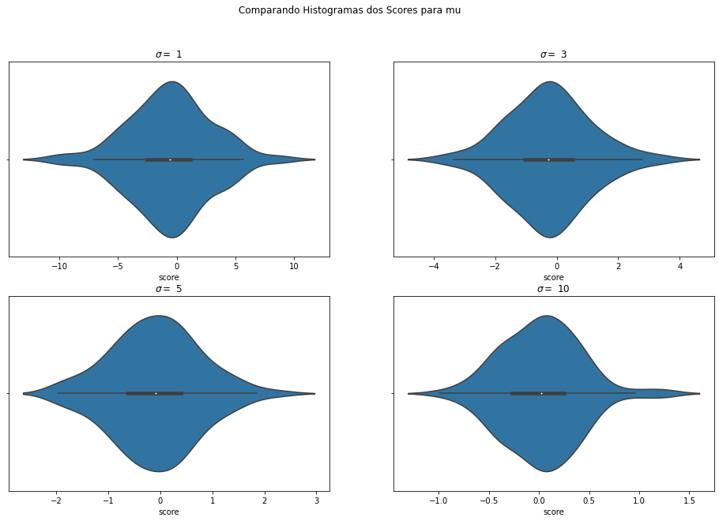
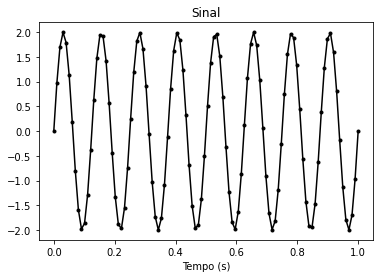

# Informação de Fisher e Cramér-Rao

Seja $X$ uma variável aleatória cuja distribuição depende de $\theta$ com densidade $f(x|\theta)$. As condições de regularidade FI são 

1. A derivada de $f(x|\theta)$ com respeito a $\theta$ existe com probabilidade 1.

2. Podemos diferenciar $\int f(x|\theta) d\mu(x)$ sob o sinal da integração. [(Veja aqui)](https://en.wikipedia.org/wiki/Leibniz_integral_rule#:~:text=General%20form%3A%20Differentiation%20under%20the%20integral%20sign,-Theorem.&text=That%20is%2C%20it%20is%20related,as%20the%20Leibniz%20integral%20rule.&text=the%20change%20of%20order%20of%20integration%20(integration%20under%20the%20integral,%3B%20i.e.%2C%20Fubini's%20theorem).).

3. O conjunto $C = \{x: f(x|\theta) > 0\}$ não depende de $\theta$.

Assuma as condições FI. 
A **informação de Fisher** é definida como 
$$
I_{\mathcal{X}}(\theta) = \mathbb{E}_{\theta}\left[\left(\frac{d}{d\theta} \log f(x|\theta)\right)^2\right].
$$
A função $\partial \log f(X|\theta)/d\theta$ é chamada de **função score**. 

Se $\theta \in \mathbb{R}^k$, definimos as **matrix informação de Fisher** como 
$$
I_{\mathcal{X}, i,j }(\theta) = \operatorname{Cov}_{\theta}\left(\frac{\partial}{\partial \theta_i} \log f(x|\theta), \frac{\partial}{\partial \theta_j} \log f(x|\theta) \right).
$$

Agora seja $X = (X_1, \dots, X_n)$ uma amostra aleatória e $f_n(x|\theta)$ a densidade conjunta de $X$.
Denote $\lambda_n(x|\theta) = \log f_n(x|\theta)$. 
Como definimos, a informação de Fisher é $I_n(\theta) = \mathbb{E}_{\theta}\{[\lambda_n'(X|\theta)]^2\}$. 
Como $\log f_n(x|\theta) = \sum_{i=1}^n \log f(x_i|\theta)$, temos que 
$$
I_n(\theta) = nI_{\mathcal{X}}(\theta).
$$
Portanto, para amostras aleatórias, basta calcular a informação considerando a densidade de uma variável aleatória. 

**Teorema:** Se valem as condições de regularidade FI, a média da função score é 0, isto é, 
$$
\mathbb{E}_{\theta}\left[\frac{d}{d\theta} \log f(X|\theta)\right] = 0,
$$
pois podemos tirar a derivada do valor esperado e, então, basta ver que a integral da densidade é constante igual a $1$. 
Logo, vale que a derivada é nula.
Além do mais,
$$
I_{\mathcal{X}}(\theta) = -\mathbb{E}_{\theta}\left[\frac{d^2}{d\theta^2} \log f(X|\theta)\right]
$$

Esse resultado se estende para mais dimensões, com 
$$
I_{\mathcal{X}, i,j}(\theta) = -\mathbb{E}_{\theta}\left[\frac{\partial^2}{\partial \theta_i \partial \theta_j} \log f(X|\theta)\right].
$$

```python
import numpy as np
from scipy.stats import norm
from scipy.misc import derivative
from scipy.optimize import curve_fit 

import matplotlib.pyplot as plt 
from seaborn import violinplot
import inspect
```

## Exemplo Construtivo

Vamos pensar num caso bem simples: amostra aleatória $X_1, ..., X_n \sim \text{Normal}(\mu, \sigma^2)$, onde o parâmetro $\sigma^2$ é conhecido e $\mu$ não.  

De forma direta, poderíamos perguntar qual a Informação de Fisher (ou Informação Diferencial) da amostra aleatória sobre o parâmetro desconhecido $\mu$. 

1. Vamos encontrar a distribuição conjunta:

$$f(x|\mu) = \frac{1}{\sqrt{2\pi\sigma^2}}\exp\left[-\frac{1}{2}\frac{(x - \mu)^2}{\sigma^2}\right]$$

$$
\begin{split}
f_n(x|\mu) &= \prod_{i=1}^n f(x_i|\mu) = \frac{1}{(2\pi\sigma^2)^{n/2}}\exp\left[-\frac{1}{2\sigma^2}\sum_{i=1}^n (x_i - \mu)^2\right] \\ 
&= \frac{1}{(2\pi\sigma^2)^{n/2}}\exp\left[-\frac{1}{2\sigma^2}\sum_{i=1}^n (x_i^2 - 2x_i\mu + \mu^2)\right] \\
&= \frac{1}{(2\pi\sigma^2)^{n/2}}\exp\left[-\frac{1}{2\sigma^2}\left(\sum_{i=1}^n x_i^2 - 2n\bar{x}_n\mu + n\mu^2\right)\right] \\
&= \frac{1}{(2\pi\sigma^2)^{n/2}}\exp\left[-\frac{1}{2\sigma^2}\sum_{i=1}^n x_i^2\right]\exp\left[-\frac{1}{2\sigma^2}\left(- 2n\bar{x}_n\mu + n\mu^2\right)\right]
\end{split}
$$ 

2. Vamos encontrar a verossimilhança: é a distribuição conjunta como função do parâmetro! 

$$f_n(x|\mu) = \frac{1}{(2\pi\sigma^2)^{n/2}}\exp\left[-\frac{1}{2\sigma^2}\sum_{i=1}^n x_i^2\right]\exp\left[-\frac{1}{2\sigma^2}\left(- 2n\bar{x}_n\mu + n\mu^2\right)\right]$$ 

Vamos comparar para $\sigma = 1$ e $\sigma = 5$


```python
loglikelihood = lambda mu, sigma, x: np.sum(np.log([norm(loc = mu, scale = sigma).pdf(xi) for xi in x]), axis = 0)
```


```python
sigmas = [1,3,5,10]
mu_true = 5

mu_range = np.linspace(0,10,1000)
```


```python
fig,ax = plt.subplots(2,2,figsize = (16, 10))

fig.suptitle('Comparando Log-verossimilhanças da Distribuição Normal')

def generate_curves(sigma, ax, n = 20, n_times = 50): 
    
    for i in range(n_times):

        x = np.random.normal(loc = mu_true, scale = sigma, size = n)
        logvalues = loglikelihood(mu_range, sigma, x)

        ax.plot(mu_range, logvalues, color = 'blue', alpha = 0.2)
        
    ax.vlines(mu_true, ymin = ax.get_ylim()[0], ymax = ax.get_ylim()[1], linestyle = '--')

    ax.set_title(r'$\sigma =$ {}'.format(sigma))
    ax.set_xlabel(r'$\mu$')
    
generate_curves(sigmas[0], ax[0][0])
generate_curves(sigmas[1], ax[0][1])
generate_curves(sigmas[2], ax[1][0])
generate_curves(sigmas[3], ax[1][1])    
```





4. Vamos ver como se comporta derivada. Esse é o score: 

$$\lambda '_n(y|\mu) = \frac{1}{\sigma^2}\left(n\bar{x}_n - \mu\right)$$


```python
score = lambda mu, sigma, x: derivative(loglikelihood, mu, dx = 1e-5, args = (sigma, x))  

fig,ax = plt.subplots(2,2,figsize = (16, 10))

fig.suptitle('Comparando Scores da Distribuição Normal')

def generate_curves(sigma, ax, n = 20, n_times = 50): 
    
    for i in range(n_times):

        x = np.random.normal(loc = mu_true, scale = sigma, size = n)
        scorevalues = score(mu_range, sigma, x)

        ax.plot(mu_range, scorevalues, color = 'blue', alpha = 0.2)
        
    ax.vlines(mu_true, ymin = ax.get_ylim()[0], ymax = ax.get_ylim()[1], linestyle = '--')

    ax.set_title(r'$\sigma =$ {}'.format(sigma))
    ax.set_xlabel(r'$\mu$')
    
    ax.set_ylim((-10,10))
    
generate_curves(sigmas[0], ax[0][0])
generate_curves(sigmas[1], ax[0][1])
generate_curves(sigmas[2], ax[1][0])
generate_curves(sigmas[3], ax[1][1])    
```


```python
fig,ax = plt.subplots(2,2,figsize = (16, 10))

fig.suptitle('Comparando Histogramas dos Scores para mu')

def generate_histograms(mu, sigma, ax, n = 15, n_times = 100): 
    
    scorevalues = []
    for i in range(n_times):

        x = np.random.normal(loc = mu_true, scale = sigma, size = n)
        scorevalues.append(score(mu, sigma, x))

    violinplot(scorevalues, ax = ax)

    ax.set_title(r'$\sigma =$ {}'.format(sigma))
    ax.set_xlabel('score')
    
generate_histograms(5, sigmas[0], ax[0][0])
generate_histograms(5, sigmas[1], ax[0][1])
generate_histograms(5, sigmas[2], ax[1][0])
generate_histograms(5, sigmas[3], ax[1][1])    
```





5. A informação de Fisher é a Variância da função score em $X$, isto é: 

$$
\begin{split}
I_n(\mu) &= Var(\lambda '_n(x|p)) = E[(\lambda '_n(x|p))^2] - E[\lambda '_n(x|p)]^2\\ 
&= \frac{1}{\sigma^4}Var\left[n\bar{x}_n - \mu\right] \\
&= \frac{n^2}{\sigma^4}Var(\bar{x}_n) \\
&= \frac{n^2\sigma^2}{n\sigma^4} \\
&= \frac{n}{\sigma^2}
\end{split}
$$

## Limites inferiores para a variância

Para estimadores não enviesados, o erro quadrático se iguala à variância. 
Como nem sempre é possível obter valores exatos para variância, é de interesse procurar por limites inferiores desses valores. 
Mais do que isso, se encontramos um estimador cuja variância seja um limite inferior, estaremos encontrando um UMVUE.

### Desigualdade da variância

A desigualdade de Cauchy-Schwarz para variáveis aleatórias, tratando a covariância como um produto interno nesse espaço, é escrita da seguinte forma:
$$
|\operatorname{Cov}(X,Y)| \le \sqrt{\operatorname{Var}(X)}\sqrt{\operatorname{Var}(Y)}
$$

### Limite inferior de Cramér-Rao

Sejam $I_{\mathcal{X}}(\theta)$ a [informação de Fisher](https://lucasmoschen.github.io/ta-sessions/infestatistica_MSc/fisher/fisher) e $\phi(X)$ uma estatística com esperança finita. Suponha que valha algumas condições de regularidade(XXX: Quais?) e que $\forall \theta, I_{\mathcal{X}}(\theta) > 0$. 
Então 
$$
\operatorname{Var}_{\theta}(\phi(X)) \ge \frac{\left(\frac{d}{d\theta} \mathbb{E}_{\theta} \phi(X) \right)^2}{I_{\mathcal{X}}(\theta)}.
$$

Observe que se $\phi(X)$ é não enviesado, então o limite inferior da variância é o inverso da informação de Fisher.

---
``📝`` **Exemplo (Normal)**

Seja $X \sim N(\theta, b)$ com $b$ fixo. 
Um estimador para $\theta$ é $\phi(X) = X$, que é não enviesado, em particular. 
A informação de Fisher é 
$$
I_{\mathcal{X}}(\theta) = - \mathbb{E}_{\theta}\left[\frac{d^2}{d\theta^2} \log f(X|\theta) \right] = 1/b,
$$
o que implica que $\operatorname{Var}(\phi(X))$ é limitado inferiormente por $b$. Só que sabemos que ele atinge esse valor.
Portanto, esse estimador é UMVUE, pois tem variância mínima.

---

A desigualdade de Cramér-Rao é uma consequência da desigualdade de Cauchy-Schwarz. 
Esta última diz que vale a igualdade se, e somente se, os fatores são linearmente independentes. 
No nosso, caso, isso significa que a desigualdade de Cramér-Rao se torna uma igualdade se, e somente se, $\phi(X)$ e a função $\frac{d}{d\theta}\log f(X|\theta)$ são linearmente relacionadas, isto é,
$$
\frac{d}{d\theta} \log f(X|\theta) = a(\theta)\phi(X) + b(\theta).
$$
Resolvendo essa equação, obtemos que 
$$
f(X|\theta) = c(\theta)h(x)\exp\{\pi(\theta)\phi(x)\},
$$
que pertence à família exponencial.
Logo, se $\phi(X)$ é uma estatística suficiente para um parâmetro de uma distribuição vinda da família exponencial, a desigualdade de Cramér-Rao vira uma igualdade. Além disso, essa é única situação.

> Fora da família exponencial, a desigualdade de Cramér-Rao não pode ser alcançada! Se uma estatística tem variância igual ao limite inferior de Cramér-Rao, ele é dito **estimador eficiente**.

### Desigualdade de Chapman-Robbins

Seja $m(\theta) = \mathbb{E}_{\theta}(\phi(X))$ e $supp(\theta)$ o suporte da distribuição de $X$.
Assuma que para cada $\theta \in \Omega$, exista $\theta'\neq\theta$ tal que $supp(\theta') \subseteq supp(\theta)$ (isso acontece quando $supp \theta$ é o mesmo para todo $\theta$).
Então,
$$
\operatorname{Var}_{\theta}(\phi(X)) \ge \sup_{\theta ' : supp(\theta') \subseteq supp(\theta)} \left\{\frac{[m(\theta) - m(\theta ')]^2}{\mathbb{E}_{\theta}\left[\frac{f_{X|\theta}(X|\theta ')}{f_{X|\theta}(X|\theta)} - 1\right]^2}\right\}
$$

Note que essa desigualdade vale para casos mais gerais. 
Porém, ela também é consequência da desigualdade de Cauchy-Schwarz.

### Sistema de Bhattacharyya

Assuma as condições do Teorema de Cramér-Rao e que a derivada sob $\theta$ pode passar sob o sinal de integração
Então $\operatorname{Var} \phi(X) \ge \gamma^T (\theta) J^{-1}(\theta)\gamma(\theta)$, 
em que 
$$
\gamma_i(\theta) = \frac{d^i}{d\theta^i}\mathbb{E}_{\theta}[\phi(X)], J_{ij}(\theta) = \operatorname{Cor}(\psi_i(X,\theta), \psi_j(X,\theta)), \psi_i(x,\theta) = \frac{1}{f(x|\theta)}\frac{d^i}{d\theta^i} f(x|\theta).
$$

Esse resultado é uma consequência direta de uma desigualdade envolvendo variância de um estimador e covariâncias dele com outras funções dos dados e do parâmetro.

### Desigualdade de Cramér-Rao multidimensional

Assumindo as condições do caso unidimensional mais que a matriz informação de Fisher seja positiva definida, então
$$
\operatorname{Var}_{\theta}(\phi(X)) \ge \gamma^T(\theta) I_X^{-1}(\theta)\gamma(\theta),
$$
em que $\gamma_i(\theta) = \frac{d}{d\theta_i} \mathbb{E}_{\theta} \phi(X)$.


## Exemplo Numérico do limite de Cramér-Rao

[Referência](http://michal.rawlik.pl/2014/02/21/numerical-cramer-rao-bound-in-python/)

Considere um sinal (como uma música) com três parâmetros, amplitude, frequência e fase inicia.

Saberemos o número de amostras que sera 100Hz com nível de ruído de 0.1 


```python
s = lambda t,a,f,ph: a*np.sin(2*np.pi*f*t + ph) # função que representa o sinal

p0 = [2,8,0]     # Amplitude, frequência e fase inicial para testar 
noise = 0.1

T = np.linspace(0,1,100)   #100 valores entre 0 e 1 igualmente espaçados
plt.plot(T, s(T, *p0), '.-k')
plt.xlabel('Tempo (s)')
plt.title('Sinal')
plt.show()
```





Vamos usar [inspect](https://docs.python.org/3/library/inspect.html) para nos ajudar a pegar labels das funções, isto é, os parâmetros necessários das funções. Essa biblioteca fornece várias funções de ajuda desse tipo. Dê uma olhada. 


```python
parameters = str(inspect.signature(s)).strip('()').replace(' ', '').split(',')[1:]
p0dict = dict(zip(parameters, p0))
p0dict
```


    {'a': 2, 'f': 8, 'ph': 0}


No caso geral, calcular a Matriz de Informação de Fisher não é trivial. Por isso, vamos calcular para o caso em que as medições são de uma amostra com distribuição multivariada normal, isto é, é uma distribuição normal, só que em mais dimensões, em particular, 441 dimensões (número de pontos no tempo)

Se calcularmos a informação de Fisher, podemos ver que:

$$
\mathcal{I}_{mn} = \frac{1}{\sigma^2} \frac{\partial \mu^\mathrm{T}}{\partial \theta_m} \frac{\partial \mu}{\partial \theta_n} = \frac{1}{\sigma^2} \sum_k \frac{\partial \mu_k}{\partial \theta_m} \frac{\partial \mu_k}{\partial \theta_n}
$$

onde $\theta = [a,f,ph]^T$, $\mu = \mu(\theta)$ é o vetor média da normal multivariada e $\sigma^2$ é a variância de cada marginal da normal. Não se assuste. Na multivariada, temos uma matriz para indicar as variâncias (ela se chama Matriz de Covariâncias, na verdade). O que estou dizendo é que ela é $\sigma^2$ vezes a identidade. É bom conhecer essa distribuição!

Por enquando acredite em mim! Ou no [Wikipedia](https://en.wikipedia.org/wiki/Fisher_information#Multivariate_normal_distribution).

Vou chamar $D_{ik} = \frac{\partial \mu_k}{\partial \theta_i}$


```python
# Usamos ** para desempacotar elementos de um dicionário.
string = "a: {a} f: {f} ph: {ph}".format(**p0dict)
print(string)
```

    a: 2 f: 8 ph: 0


```python
D = np.zeros((len(p0), len(T)))

# para cada parâmetro
for i, parameter in enumerate(parameters):
    # para cada ponto no tempo
    for k, t in enumerate(T):
         
        func = lambda x: s(t, **dict(p0dict, **{parameter: x}))
        # Calculamos a derivada com respeito a x, que nesse caso é o valor do parametro
        D[i,k] = derivative(func, p0dict[parameter], dx = 1e-4)   
```

Veja que o tamanho de D é o seguinte:


```python
D.shape
```


    (3, 100)


```python
plt.plot(T, s(T, *p0), '--k', lw=2, label='Sinal')

for Di, parameter in zip(D, parameters):
    # Estamos acessando Di = linha_i(D)
    plt.plot(T, Di, '.-', label=parameter)
    
plt.legend()
plt.xlabel('Tempo (s)')
plt.show()
```


O que $D_{ik}$ indica? É a derivada da $k-ésima$ média com respeito ao i-ésimo parâmetro. Logo indica o quanto o quando a amostra $k$ afeta o parâmetro $i$. Veja que quando temos picos no seno, teremos pico na amplitude,. Também vemos que a fase inicial não tem essa relevância. Vemos também que o sinal se torna mais e mais sensível à frequência. 

Assim, podemos calular a informação de fisher, usando [einsum](https://numpy.org/doc/stable/reference/generated/numpy.einsum.html)


```python
I = 1/noise**2*np.einsum('mk,nk', D, D)
print(I)
```

    [[ 4.95000000e+03 -5.64643569e+02 -3.43706036e-09]
     [-5.64643569e+02  2.68635205e+05  6.34601694e+04]
     [-3.43706036e-09  6.34601694e+04  2.01999999e+04]]


Podemos calcular o limite de Cramér-Rao para qualquer estimador não enviesado. Nesse caso, veja [aqui](https://en.wikipedia.org/wiki/Cram%C3%A9r%E2%80%93Rao_bound#Multivariate_case) para mais detalhes. Mas não se incomode com os detalhes, se preferir. 


```python
iI = np.linalg.inv(I)  

print('Cramér-Rao Limite Inferior')
for parameter, variance in zip(parameters, iI.diagonal()):
    print('{}: {:.2g}'.format(parameter, np.sqrt(variance)))
```

    Cramér-Rao Limite Inferior
    a: 0.014
    f: 0.0038
    ph: 0.014